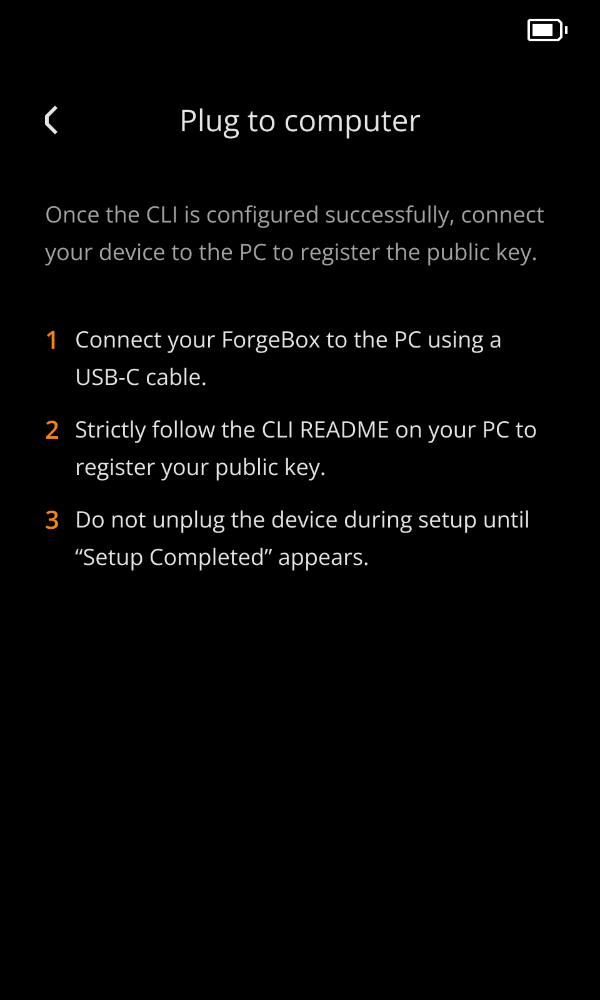

# ForgeBox 101

ForgeBox is an open hardware platform for developers, researchers, and educators who want to run their own code on a secure device.

The point of ForgeBox is control: you can experiment with custom firmware, build your own signing flows, prototype security features, and test cryptographic ideas on real hardware.

Built on the Keystone 3 hardware wallet architecture, ForgeBox is designed to give you a secure but flexible base for:

- cryptography and blockchain research
- custom signing and key-management tools
- hardware-backed agent or application experiments
- teaching secure systems with programmable hardware

## Order ForgeBox

You can order ForgeBox here: [Order ForgeBox](https://keyst.one/shop/products/keystone-3-forge-box?variant=KV032-FB-SD).

## What Makes ForgeBox Different

- **Open source**: the hardware platform is meant to be customized, not treated as a sealed black box.
- **Secure by design**: ForgeBox is based on hardened wallet architecture and uses secure hardware components.
- **Built for iteration**: you can inspect the device, generate keys, register your own public key, build firmware, and sign OTA packages with the CLI.

## Who This Page Is For

This guide is for people who ordered ForgeBox and want a practical starting point. It will help you set up ForgeBox and get your first Hello World firmware running.


## What You Need

Before you begin, make sure you have:

- your ForgeBox device
- a USB-C cable that supports data transfer
- a computer with Node.js and npm installed
- `python3` installed if you plan to build firmware
- an ARM embedded toolchain such as `arm-none-eabi-gcc` if you plan to compile firmware from source

## Setup In 10 Minutes

### 1. Install the CLI

ForgeBox is managed through the ForgeBox CLI.

Source code and full CLI documentation are available in the [forgebox-cli repository](https://github.com/KeystoneHQ/forgebox-cli).

```bash
npm install -g forgebox-cli
forgebox --version
forgebox --help
```

### 2. Connect the Device

Plug ForgeBox into your computer over USB-C.

Then list connected devices:

```bash
forgebox list-devices
```

If the device is detected, you should see ForgeBox in the device list.

### 3. Check Device Status

Confirm the device is reachable and inspect its basic information:

```bash
forgebox status
```

This should show information such as:

- model
- firmware version
- hardware version
- serial number

If this step works, your local setup is ready for key registration and firmware workflows.

### 4. Generate a Key Pair

ForgeBox uses your key material for signing and registration workflows.

Create a fresh key pair:

```bash
forgebox keygen --out ./my-keys
```

This writes:

- `./my-keys/private.pem`
- `./my-keys/pubkey.pem`

Treat `private.pem` as sensitive material. Anyone with that file can sign firmware as you.

### 5. Register Your Public Key On Device

> **Important:** Once the key is registered, ForgeBox can verify firmware packages signed with the matching private key.
>
> The public key can only be registered once, so store the key pair very safely and carefully.

Register the generated key pair with ForgeBox:

```bash
forgebox register ./my-keys
```

During registration:
1. Confirm that your ForgeBox is on the same registration step shown in the image below.
2. The CLI checks that the public and private key match.
3. The device displays a fingerprint.
4. Compare the fingerprint shown in the terminal with the one shown on the device.
5. If they match, confirm on the device.



## Build and Load Hello World Firmware

The fastest way to prove your setup works is to build the Hello World example, sign it, and load it onto the device.

### 1. Open the Hello World Example

Use the `forgebox-helloworld` example project.

If you already have the repository locally:

```bash
cd forgebox-helloworld
```

### 2. Build the Firmware

You can build it either locally or with Docker.

**Option A: Build locally**

```bash
python3 build.py -e production
```

This produces `build/mh1903_full.bin`.

**Option B: Build with Docker**

```bash
docker build --target builder -t forgebox-helloworld-builder .

container_id=$(docker create forgebox-helloworld-builder)
docker cp "$container_id":/forgebox-helloworld/build ./build
docker rm "$container_id"
```

This also gives you `build/mh1903_full.bin`.

### 3. Sign the Firmware

Turn the built firmware into a signed OTA package with the private key you registered earlier:

```bash
forgebox sign --s ./build/mh1903_full.bin --d ./build/forgebox.bin --key ./my-keys/private.pem
```

This creates `build/forgebox.bin`, which is the file you load onto the device.

### 4. Load It Onto ForgeBox

1. Copy `build/forgebox.bin` to an SD card.
2. Insert the SD card into ForgeBox.
3. Start the firmware upgrade flow on the device.
4. Select the signed firmware package and confirm the upgrade.

After the upgrade completes, ForgeBox should boot into the Hello World firmware.


## If You Get Stuck

1. Check that the device is visible with `forgebox list-devices`.
2. Check that `forgebox status` returns device information.
3. Confirm that `build/mh1903_full.bin` exists before running `forgebox sign`.
4. Regenerate a clean key pair and retry registration if signing or verification fails.

If those steps work, your hardware path, key registration, and firmware package are usually in good shape.


